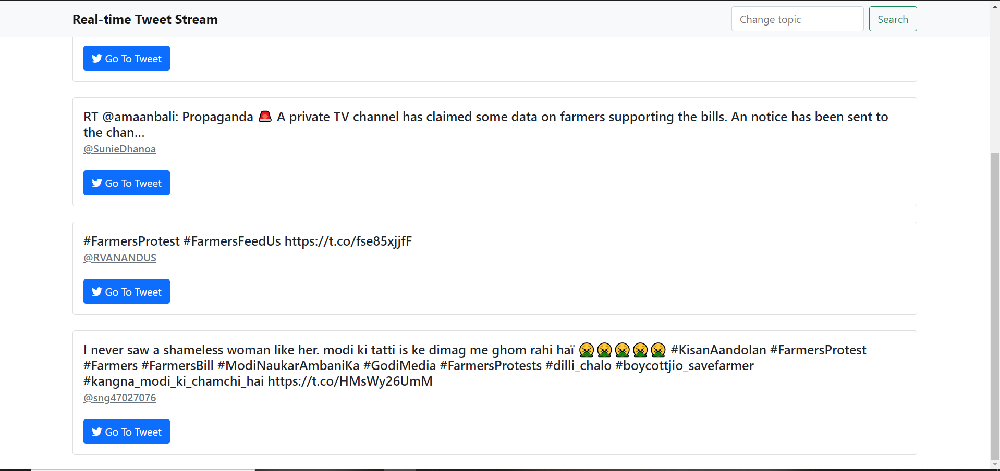

# Real-time Tweet Stream
> Get real-time tweets and display on webpage with socket.io

## Usage
Rename .example.env to .env

Go to https://developers.twitter.com portal and get a bearer token and add it to the .env file

From the root folder:
```
# Install dependencies
npm install

# Run (port: 3000)
npm start
```

## Screenshots
